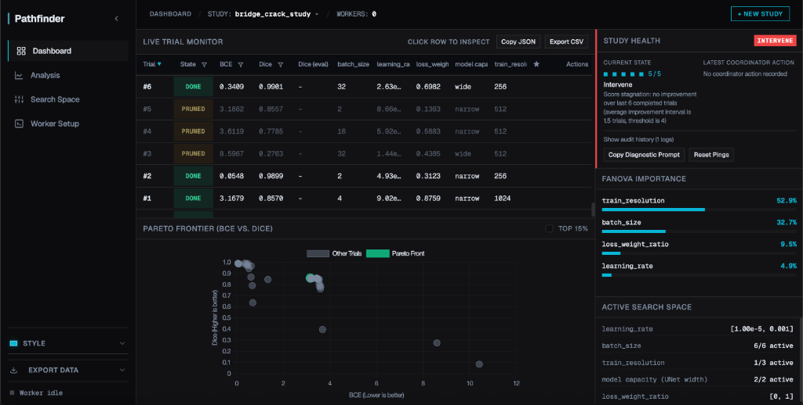
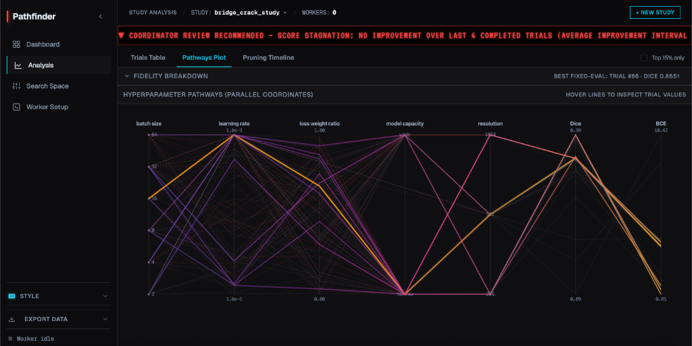
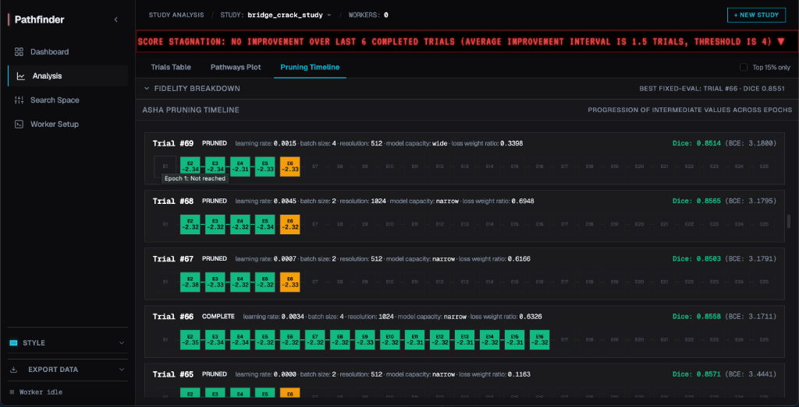

# Pathfinder

[](https://www.python.org/downloads/)
[](https://fastapi.tiangolo.com/)
[](https://optuna.org/)
[](https://www.sqlite.org/)
[](https://modelcontextprotocol.io/)
[](https://github.com/Ishaan1402/pathfinder/actions)
[](LICENSE)

A layered hyperparameter optimization (HPO) framework that keeps quick Optuna suggestions seperate from episodic AI reviews. Workers run training script loops autonomously updating with optimized HPs without being blocked by LLM evaluation. This leaves you (or agents in your IDE) to review results periodically and decide when to adjust the search space or overarching strategy.

<table border="0">
  <tr>
    <td width="67%" valign="top">
      
    </td>
    <td width="33%" valign="top">
      
      
    </td>
  </tr>
</table>

  **Designed for:** ML researchers and students tuning deep learning models on their own infrastructure (local GPU, Colab, cloud VMs). Connect your existing training loop in just 4 lines of code — see [For Your Own Project](#onboarding-your-own-project) below.

## Why Pathfinder?

**Problem:** Traditional HPO frameworks execute fast, but they typically operate within fixed boundaries. If your initial search space is poorly posed or if specific hyperparameter combinations trigger hardware failures (like CUDA OOMs or gradient explosions), a traditional optimizer will blindly burn through your GPU budget until it hits its limit. Fixing this requires the researcher to manually monitor charts, context-switch out of the IDE, and rewrite configuration files by hand.

**Solution:** Three independent layers:

- **Broker (Optuna TPE)**: Quick, deterministic suggestion engine. Hyperparameter suggestions and pruning happen in <10ms. Workers access this endpoint and continue training.
- **Worker**: Train autonomously in loops. Report metrics incrementally. Handles pruning (early stoppage), OOM, checkpointing. 
- **Coordinator (You + Optional LLM)**: Run episodic reviews when *you* decide. Inspect trial history, check search health, propose bounds changes. AI agents (Claude, Cursor) can run reviews via MCP tools.

All state lives in **SQLite** making it easy to resume reviews, audit decisions, and sync across machines.

## Quick Start

### Step 1: Start the Broker

The broker manages the study state and serves the dashboard. You can run it via Docker or Python.

**Option A: Docker (Zero-Install)**

```bash
docker-compose up -d
# Dashboard: http://127.0.0.1:8000
```

**Option B: Local Python (3.10+)**

```bash
python3 -m venv .venv
source .venv/bin/activate
pip install -r requirements.txt
python broker.py --daemon
# Dashboard: http://127.0.0.1:8000
```

### Step 2: Connect Your Workers

Workers run your training loops. They can be on the same machine or remote.

**Local Workers on the same machine**

```bash
# Replace 'train.py' with your own training script
HPO_BROKER_URL=http://localhost:8000 HPO_STUDY_NAME=my_study python train.py
```

**Remote Workers (Colab / Cloud GPU)**
To connect remote workers to your local broker, use a tunnel:

```bash
# Local Terminal: Start broker with tunnel + auth
export HPO_SECRET_TOKEN="$(python -c 'import secrets; print(secrets.token_urlsafe(32))')"

# ngrok (auto-generates URL)
python broker.py --daemon --tunnel

# OR Cloudflare (bring your own domain)
python broker.py --daemon --tunnel-provider cloudflare --tunnel-url https://your-domain.com

# Prints: 🔥 Remote broker URL established: https://...

# Remote Server Terminal: Set environment and run your worker
export HPO_BROKER_URL="https://..."
export HPO_SECRET_TOKEN="<your-token>"
python train.py
```

### Step 3: Agent Integration (Optional)

Point Claude Code, Cursor, Antigravity, etc to the MCP server for agent-driven onboarding and reviews. See [IDE Setup](#ide-setup-agent-driven-onboarding--reviews) below.

### Environment Variables Reference

Pathfinder supports the following optional environment variables for users:

- `HPO_DATABASE_URL`: SQLite connection string (default: `sqlite:///hpo_studies.db`).
- `HPO_BROKER_URL`: The URL where the broker is running (e.g. `http://localhost:8000`). Required by workers.
- `HPO_STUDY_NAME`: The active study name. Overrides what is passed in code.
- `HPO_SECRET_TOKEN`: Bearer token for securing broker endpoints in remote deployments.
- `HPO_DEBUG`: Set to `1` to enable verbose debug logging in the broker.
- `HPO_SPARKLINES`: Set to `1` in the worker to print a unicode performance curve on trial completion.

---

## Core Features

### Optuna Engine

- **Tree-structured Parzen Estimator Sampler**: Probability-based hyperparameter suggestions (beats grid search)
- **ASHA Pruning**: Cuts underperforming trials early to save GPU time
- **Single or Dual-Objective**: Optimize a single target, or map a Pareto front between one 'maximize' and one 'minimize' metric (e.g., accuracy vs. latency)
  - *(Example: An [image segmentation model](https://github.com/Ishaan1402/crack-seg#crack-seg) could map a Pareto front to maximize Dice Score while minimizing BCE Loss).*
- **fANOVA Importances**: Identifies which hyperparams actually matter to further guide your strategy

### Tuning Coordinator

- Dashboard shows health warnings (nudges to review, never auto-reviews)
- 7-step review procedure: retrieve telemetry → evaluate fANOVA → safety/OOM check → accuracy self-regulation → propose bound adjustments → submit audit trail → generate model card
- Search space proposals are staged, requiring your explicit approval before taking effect
- Coordinator accuracy tracks your reviews' forecasted score improvements vs. measured deltas
- Optional LLM integration (Claude, Gemini, OpenAI) for automatic reviews

### Persistent Study State using SQLite

All configuration, trials, reviews, and metadata live in `hpo_studies.db`:

- Active search space
- Trial results + VRAM telemetry
- Coordinator review history
- Study health tier
- Generated model cards

---

## Onboarding Your Own Project

If you cloned this to tune your own model, the easiest way to start is by having an agent (via Cursor, Claude Code, Antigravity, etc) write the manifest for you. 

After setting up the Pathfinder MCP server, simply open your training script and tell your agent something like **"help me wire this training script up to Pathfinder."**. The agent will read your script, identify tunable hyperparameters, and automatically draft the manifest.

Otherwise, you can onboard manually:

1. **Write a manifest** (`train.hpo.yaml`):
  ```yaml
   study_name: my_study
   metrics:
     objectives:
       - name: loss
         direction: minimize
       - name: accuracy
         direction: maximize
   params:
     - name: learning_rate
       type: float_log
       min: 1e-5
       max: 1e-2
     - name: batch_size
       type: categorical
       options: [4, 8, 16, 32]
   worker:
     entrypoint: python train.py
  ```
2. **Register the study**:
  ```bash
   python hpo_cli.py validate train.hpo.yaml
   python hpo_cli.py init train.hpo.yaml
  ```
3. **Update your training script** (`train.py`):
  Instead of hardcoding your hyperparameters, ask the Pathfinder broker for them at the start of your script, and report your loss at the end of each epoch. FastAPI endpoints will facilitate communication between Optuna and your training loop to auto-update inputs based on each trial's iterative output.
  ```python
   from src.hpo_client import TrialSession

   # 1. Connect to broker and get parameters
   session = TrialSession(broker_url="http://localhost:8000", study_name="my_study")
   trial = session.suggest()
   learning_rate = trial["params"]["learning_rate"]

   for epoch in range(epochs):
       loss = train_one_epoch(lr=learning_rate)

       # 2. Report metrics (Pathfinder handles pruning automatically)
       if session.report_epoch(epoch, loss=loss):
           break # Trial was pruned

   # 3. Mark completion
   session.complete(epoch, loss=loss, state="COMPLETE")
  ```
4. **Run on your GPU** (set env vars first):
  ```bash
   export HPO_BROKER_URL=http://localhost:8000
   export HPO_STUDY_NAME=my_study
   python train.py
  ```

Full integration walkthrough: [docs/INTEGRATION.md](docs/INTEGRATION.md)

---

## IDE Setup (Agent-Driven Onboarding & Reviews)

### Cursor

1. **Settings → Features → MCP**
2. **+ Add New MCP Server**
3. Name: `pathfinder`
  Type: `command`  
   Command: `source .venv/bin/activate && python3 hpo_mcp_server.py`

### Claude Code / Antigravity

Add to your MCP config (`~/.config/claudecode/mcp_config.json` or similar):

```json
{
  "mcpServers": {
    "pathfinder": {
      "command": "python3",
      "args": ["hpo_mcp_server.py"],
      "env": {
        "HPO_DATABASE_URL": "sqlite:///./hpo_studies.db"
      }
    }
  }
}
```

### Other MCP Clients (OpenCode, etc.)

Pathfinder is compliant with the Model Context Protocol standard. You can integrate it with any other MCP-compatible IDE or agent using its standard configuration method, pointing it to `python3 hpo_mcp_server.py`.

Then tell your agent:

- **"integrate HPO"** → agent drafts manifest, validates, registers study
- **"run a coordinator review"** → agent fetches study data, rates health, proposes bounds changes

See [AGENTS.md](AGENTS.md) for the full procedure.

---

## Common Commands

```bash
# Start broker + dashboard
python broker.py --daemon

# Validate & initialize a study from manifest
python hpo_cli.py validate train.hpo.yaml
python hpo_cli.py init train.hpo.yaml

# Check study health
python hpo_cli.py status

# Run a manual coordinator review (or prints prompt for copy-paste)
python hpo_cli.py review

# Export study config back to YAML
python hpo_cli.py manifest my_study

# Commit pending search space changes
python hpo_cli.py apply

# Run tests
pytest tests/ -q
```

---

## Reference: crack-seg

This Pathfinder instance was initially tuned for [crack-seg](https://github.com/Ishaan1402/crack-seg#crack-seg), a **U-Net pixel-level segmentation model** trained on high-res UAV bridge imagery. See [colab_worker.py](colab_worker.py) for the full reference implementation (dataset download, model setup, training loop).

**Don't modify `colab_worker.py`** unless you're maintaining the bridge-crack project. Cloners should use `templates/worker_minimal.py` instead.

---

## Docs

- **[AGENTS.md](AGENTS.md)** — Guide for AI agents (Claude, Cursor, Antigravity)
- **[CLAUDE.md](CLAUDE.md)** — Development commands and architecture for Claude Code
- **[examples/onboarding/](examples/onboarding/)** — Step-by-step walkthrough for a new project
- **[docs/INTEGRATION.md](docs/INTEGRATION.md)** — Worker integration contract details

---

## License

MIT License - see the [LICENSE](LICENSE) file for details.