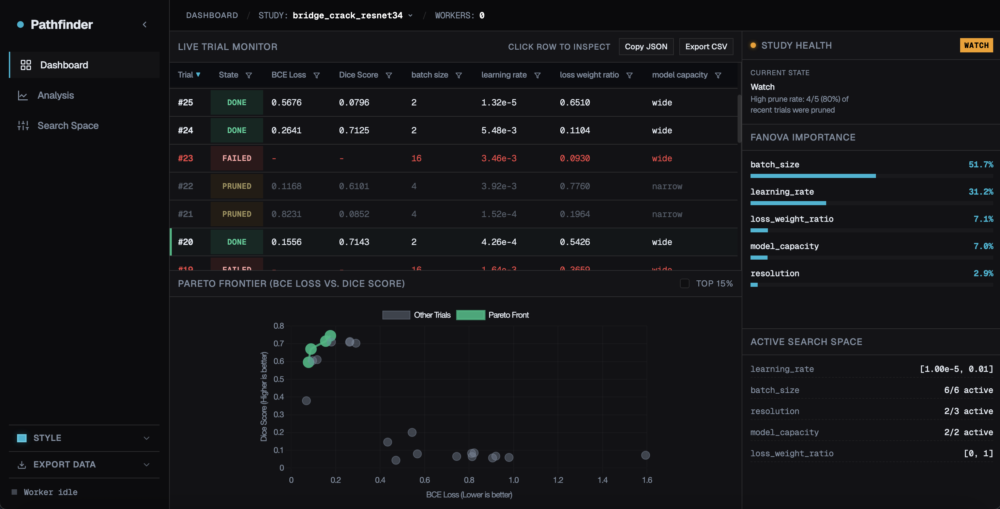

# Pathfinder

[](https://github.com/Ishaan1402/pathfinder/actions)
[](LICENSE)

Your coding agents architect training pipelines, but the optimization loop still runs completely out of their sight. Pathfinder brings that loop back in view.


<table border="0">
  <tr>
    <td width="67%" valign="top">
      
    </td>
    <td width="33%" valign="top">
      
      
    </td>
  </tr>
</table>


## How it works

2 layers:

- **Broker (FastAPI + Optuna TPE)**: Suggests hyperparameters in <10ms, prunes underperforming trials, and flags study health issues (stagnation, OOM patterns, 100% prune rates)
- **Worker**: Runs your training script in a loop. Calls `suggest`, `report_epoch`, `complete`. Reports VRAM telemetry and handles OOMs without crashing the study.

An MCP server gives your IDE agent read-only visibility into trial history, health tiers, and fANOVA importances. The agent can validate manifests and register new studies, only when you ask. The worker never waits on an LLM.

## Quick Start


### Step 1: Start the Broker

```bash
python3 -m venv .venv
source .venv/bin/activate
pip install -r requirements.txt
python broker.py --daemon
# Dashboard: http://127.0.0.1:8000
```


### Step 2: Connect Your Workers

**Local worker (same machine)**

```bash
HPO_BROKER_URL=http://localhost:8000 HPO_STUDY_NAME=my_study python train.py
```

**Remote worker (Colab / cloud GPU)**

To expose your local broker to remote workers, use a tunnel:

```bash
# Generate a token
export HPO_SECRET_TOKEN="$(python -c 'import secrets; print(secrets.token_urlsafe(32))')"

# Start broker with tunnel (ngrok auto-generates a URL)
python broker.py --daemon --tunnel

# Or with Cloudflare (bring your own domain):
python broker.py --daemon --tunnel-provider cloudflare --tunnel-url https://your-domain.com
```

Set the printed URL and token on your remote machine:

```bash
export HPO_BROKER_URL="https://..."
export HPO_SECRET_TOKEN="<your-token>"
python train.py
```

See [docs/INTEGRATION.md](docs/INTEGRATION.md) for more tunneling and auth options.

### Step 3: Connect Your Agent

Point your IDE at the MCP server for agent-driven onboarding and inspection. See [IDE Setup](#ide-setup-agent-driven-onboarding--inspection).


Environment variables are documented in [docs/INTEGRATION.md](docs/INTEGRATION.md).

## Agent Integration

Pathfinder exposes MCP tools that let your IDE agent (Cursor, Claude Code, Antigravity) participate in two workflows:

### Onboarding 

1. Agent reads your training script, identifies tunable hyperparameters and metrics
2. Agent drafts a `train.hpo.yaml` manifest
3. Agent calls `validate_manifest` to check for errors
4. Agent calls `init_from_manifest` to register the study in Optuna and SQLite
5. Agent writes a minimal worker script from `templates/worker_minimal.py`


### Inspection

1. Agent calls `get_study_data` to retrieve trial telemetry, health tier, fANOVA importances, and trial data
2. Agent summarizes: current best score, health status, OOM rate, stagnation warnings
3. Recommended search space adjustments happen by you through the dashboard Settings UI or `hpo_cli.py`


Key MCP tools: `validate_manifest`, `init_from_manifest`, `get_study_data`, `get_study_cards`, `export_manifest`.

Trigger phrases: say **"integrate HPO"** or **"wire hyperparameter tuning"** to onboard. Say **"show study health"** or **"check HPO progress"** to inspect.

Ask it anything about your experiment; it has full context on trial history, health, and importances.

See [AGENTS.md](AGENTS.md) for the full agent procedure.

---


## Onboarding Your Own Project


### 1. Write a manifest (`train.hpo.yaml`): Manually or have an agent do it for you

```yaml
study_name: my_study
metrics:
  primary_score: accuracy
  objectives:
    - name: accuracy
      direction: maximize
      label: "Accuracy"
    - name: loss
      direction: minimize
      label: "Loss"
params:
  - name: learning_rate
    type: float_log
    min: 1e-5
    max: 1e-2
  - name: batch_size
    type: categorical
    options: [4, 8, 16, 32]
worker:
  entrypoint: python train.py
```

The `primary_score` field tells the dashboard which objective to highlight.

### 2. Register the study

```bash
python hpo_cli.py validate train.hpo.yaml
python hpo_cli.py init train.hpo.yaml
```


### 3. Update your training script

```python
from src.hpo_client import TrialSession

session = TrialSession()  # reads HPO_BROKER_URL / HPO_STUDY_NAME
trial = session.suggest()
params = trial["params"]

for epoch in range(epochs):
    accuracy, loss = train_one_epoch(params, epoch)

    if session.report_epoch(epoch, score=accuracy, loss=loss):
        # Trial was pruned by the broker
        session.complete(epoch, score=accuracy, loss=loss, state="PRUNED")
        break

session.complete(epoch, score=accuracy, loss=loss, state="COMPLETE")
```

The worker contract is three calls: `suggest()`, `report_epoch()`, `complete()`. Map your higher-is-better metric to `score` and your lower-is-better metric to `loss`. Full details: [docs/INTEGRATION.md](docs/INTEGRATION.md).

### 4. Run on your GPU

```bash
export HPO_BROKER_URL=http://localhost:8000
export HPO_STUDY_NAME=my_study
python train.py
```

---


## IDE Setup 


### Cursor

**Settings → Features → MCP → + Add New MCP Server**

Name: `pathfinder`, Type: `command`, Command: `source .venv/bin/activate && python3 hpo_mcp_server.py`

### Claude Code / Antigravity

```json
{
  "mcpServers": {
    "pathfinder": {
      "command": "python3",
      "args": ["hpo_mcp_server.py"],
      "env": {
        "HPO_DATABASE_URL": "sqlite:///./hpo_studies.db"
      }
    }
  }
}
```

Pathfinder is compliant with the Model Context Protocol standard, it works with any MCP-compatible IDE.

---


## Common Commands

```bash
# Start broker + dashboard
python broker.py --daemon

# Validate and initialize a study from manifest
python hpo_cli.py validate train.hpo.yaml
python hpo_cli.py init train.hpo.yaml

# Check study health
python hpo_cli.py status

# Export study config back to YAML
python hpo_cli.py manifest my_study

# Export/import study data
python hpo_cli.py export my_study --output my_study.json
python hpo_cli.py import my_study.json

# Generate a model card
python hpo_cli.py modelcard my_study

# Delete a study
python hpo_cli.py delete my_study

# Run tests
pytest tests/ -q
```

---


## Dev Notes

- MCP tool design to inspect telemetry and modify training scripts, refactored the architecture to decouple agentic workflows from deterministic optimization path
- Implemented concurrency patterns for distributed workers, real-time detection of crashed processes
- Optimized SQLite backend performance using Write-Ahead Logging; allowing concurrent broker writes, dashboard rendering, and MCP queries without read-write blocks

---


## Reference: crack-seg

Pathfinder was initially built to tune [crack-seg](https://github.com/Ishaan1402/crack-seg#crack-seg), a U-Net pixel-level segmentation model trained on UAV bridge imagery.

---


## Docs

- **[AGENTS.md](AGENTS.md)** — Guide for AI agents (Cursor, Claude Code, Antigravity, etc)
- **[docs/INTEGRATION.md](docs/INTEGRATION.md)** — Worker integration details

---


## License

MIT License - see the [LICENSE](LICENSE) file for details.